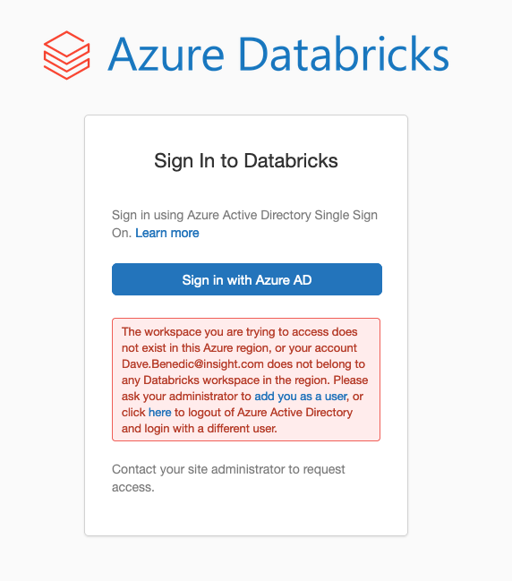

# Terraform AzureRM Lens

- [Purpose](#purpose)
- [Details](#details)
- [Usage](#usage)
- [Gotchas](#gotchas)
- [Inputs](#inputs)
- [Outputs](#outputs)
- [Contributing](#contributing)

## Purpose

- Creates a cluster and Ingest data in Azure Databricks.

## Details
- Creates a workspace with custom parameters in Azure Databricks.
- Creates a Spark pool databricks cluster and install the python libraries.
- Ingest the data using the databricks_dbfs_file.

## Usage

This module may be used via a module call specifying the following input variables.

```
provider "azurerm" {
  storage_use_azuread = true
}

module "" {
  source = "<source-path>"

  resource_group = {
    name = azurerm_resource_group.test.name
    location = azurerm_resource_group.test.location
    tags = {}

  }

  databricks = {
    name = ""
    managed_resource_group_name = ""
    sku = ""
    private_subnet_name = ""
    private_subnet_network_security_group_association_id = ""
    public_subnet_name = ""
    public_subnet_network_security_group_association_id = ""
    virtual_network_id = ""
    storage_account_name = ""
    storage_account_sku_name = ""
    service_principal_object_id = azuread_service_principal.example.object_id
    service_principal_application_id = azuread_application.example.application_id
     
      cluster = {
        name = ""
        spark_version = ""
        node_type_id = ""
        driver_node_type_id = ""
        autotermination_minutes = 
        num_workers = 
        min_workers = 
        max_workers = 
        py_libraries = []

      }
  
    }

  key_vault = module.lens_base.key_vault
  data_lake = module.lens_base.datalake
  service_principal_secret = azuread_service_principal_password.example.value

}
```

## Gotchas
- Recommend LENS be deployed as a landing zone workload into its own Subscription following the [Enterprise Scale Landing Zone Pattern](https://github.com/Azure/Enterprise-Scale)
- Must have "Owner" permission on the LENS Resource Group (or at the Subscription level) to be able to perform RBAC role assignments. Please note that this is NOT overly privileged if following Enterprise Scale Landing Zone pattern.
- If using AzureRM provider < 3.x, be sure to enable `storage_user_azuread` to leverage MSAL authentication.
- Terrafom apply is failing to login to databricks with an error(User not authorized).



- As a workaround, launch databricks workspace from the resource group and re-run terraform apply.