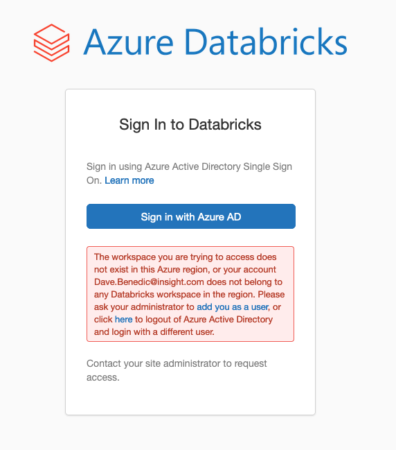

<!-- BEGIN_TF_DOCS -->
# Terraform AzureRM Lens

- [Purpose](#purpose)
- [Details](#details)
- [Usage](#usage)
- [Gotchas](#gotchas)
- [Inputs](#inputs)
- [Outputs](#outputs)
- [Contributing](#contributing)

## Purpose

- Creates a cluster and Ingest data in Azure Databricks.

## Details
- Creates a workspace with custom parameters in Azure Databricks.
- Creates a Spark pool databricks cluster and install the python libraries.
- Ingest the data using the databricks\_dbfs\_file.

## Usage

This module may be used via a module call specifying the following input variables.

```
provider "azurerm" {
  storage_use_azuread = true
}

module "" {
  source = "<source-path>"

  resource_group = {
    name = azurerm_resource_group.test.name
    location = azurerm_resource_group.test.location
    tags = {}

  }

  databricks = {
    name = ""
    managed_resource_group_name = ""
    sku = ""
    private_subnet_name = ""
    private_subnet_network_security_group_association_id = ""
    public_subnet_name = ""
    public_subnet_network_security_group_association_id = ""
    virtual_network_id = ""
    storage_account_name = ""
    storage_account_sku_name = ""
    service_principal_object_id = azuread_service_principal.example.object_id
    service_principal_application_id = azuread_application.example.application_id
     
      cluster = {
        name = ""
        spark_version = ""
        node_type_id = ""
        driver_node_type_id = ""
        autotermination_minutes =
        num_workers =
        min_workers =
        max_workers =
        py_libraries = []

      }
    }

  key_vault = module.lens_base.key_vault
  data_lake = module.lens_base.datalake
  service_principal_secret = azuread_service_principal_password.example.value

}
```

## Gotchas
- Recommend LENS be deployed as a landing zone workload into its own Subscription following the [Enterprise Scale Landing Zone Pattern](https://github.com/Azure/Enterprise-Scale)
- Must have "Owner" permission on the LENS Resource Group (or at the Subscription level) to be able to perform RBAC role assignments. Please note that this is NOT overly privileged if following Enterprise Scale Landing Zone pattern.
- If using AzureRM provider < 3.x, be sure to enable `storage_user_azuread` to leverage MSAL authentication.
- Terrafom apply is failing to login to databricks with an error(User not authorized).



- As a workaround, launch databricks workspace from the resource group and re-run terraform apply.

## Inputs

| Name | Description | Type | Default | Required |
|------|-------------|------|---------|:--------:|
| <a name="input_location"></a> [location](#input\_location) | The Azure region where the resources will be deployed. | `string` | n/a | yes |
| <a name="input_resource_group_name"></a> [resource\_group\_name](#input\_resource\_group\_name) | The name of the resource group where modules resources will be deployed. The resource group location will be used for all resources in this module as well. | `string` | n/a | yes |
| <a name="input_databricks"></a> [databricks](#input\_databricks) | New Databricks Workspace resource | <pre>object({<br>    name                     = string<br>    sku                      = string<br>    storage_account_sku_name = string<br>  })</pre> | <pre>{<br>  "name": "lens-databricks",<br>  "sku": "standard",<br>  "storage_account_sku_name": "Standard-GRS"<br>}</pre> | no |
| <a name="input_tags"></a> [tags](#input\_tags) | Tags to set for all resources | `map(string)` | `{}` | no |
| <a name="input_virtual_network"></a> [virtual\_network](#input\_virtual\_network) | Integrate Databricks with Azure Virtual Network | <pre>object({<br>    enabled                                              = bool<br>    virtual_network_id                                   = string<br>    private_subnet_name                                  = string<br>    private_subnet_network_security_group_association_id = string<br>    public_subnet_name                                   = string<br>    public_subnet_network_security_group_association_id  = string<br>  })</pre> | <pre>{<br>  "enabled": false,<br>  "private_subnet_name": "",<br>  "private_subnet_network_security_group_association_id": "",<br>  "public_subnet_name": "",<br>  "public_subnet_network_security_group_association_id": "",<br>  "virtual_network_id": ""<br>}</pre> | no |

## Outputs

| Name | Description |
|------|-------------|
| <a name="output_workspace"></a> [workspace](#output\_workspace) | Databricks Workspace Details |

## Contributing
### Pre-Commit Hooks

Git hook scripts are useful for identifying simple issues before submission to code review. We run our hooks on every commit to automatically point out issues in the Terraform code such as missing parentheses, and to enforce consistent Terraform styling and spacing. By pointing these issues out before code review, this allows a code reviewer to focus on the architecture of a change while not wasting time with trivial style nitpicks.

#### Pre-Commit Installation

Before you can run hooks, you need to have the pre-commit package manager installed.

Using pip:

```
pip install pre-commit
```

Non-administrative installation:

to upgrade: run again, to uninstall: pass uninstall to python
does not work on platforms without symlink support (windows)

```
curl https://pre-commit.com/install-local.py | python -
```

Afterward, `pre-commit --version` should show you what version you're using.

#### Pre-Commit Configuration

The pre-commit config for this repo may be found in `.pre-commit-config.yaml`, the contents of which takes the following form:

Run `pre-commit install` to set up the git hook scripts:

```
$ pre-commit install
pre-commit installed at .git/hooks/pre-commit
```

Now pre-commit will run automatically on git commit
<!-- END_TF_DOCS -->


#### _this README is auto-generated by [terraform-docs](https://terraform-docs.io)_